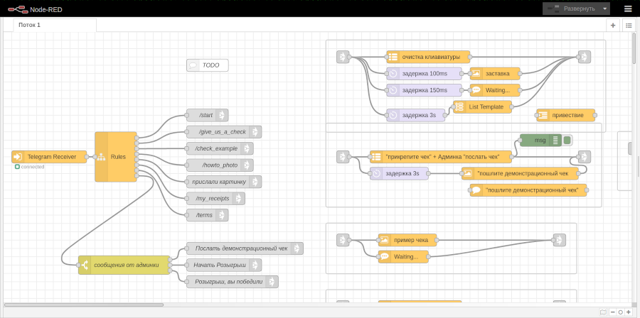

# Запуск проекта бота в Node-RED



Чтобы запустить проект демо-бота в node-red и побаловаться, надо:

Создать своего бота у `@botfather`, затем в консоли: 
```
docker-compose up
```
Открыть в браузере [http://127.0.0.1:11880/](http://127.0.0.1:11880/)

Поставить модули (Главное меню -> Управление палитрой -> Установить):
  - `node-red-contrib-chatbot`
  - `node-red-contrib-image-tools`
  - `node-red-contrib-telegrambot`

Импортировать проект `flows.json` (Главное меню -> Импорт -> Выберите файл для импорта).

Задать конфиг для ноды `Telegram Receiver` (Свойства -> Bot configuration):
  - Bot name
  - Token

Нажать `Развернуть`.

Готово!